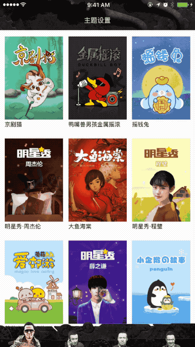

<p align="center">
  
</p>

<p align="center">
<a href="#demo">Demo</a> -
<a href="#installation">Installation</a> -
<a href="#documents">Documents</a> -
<a href="#contribution">Contribution</a> - 
<a href="https://github.com/wedxz/LNTheme/blob/master/README_CN.md">中文文档</a>
</p>

<p align="center">
<a href="http://cocoadocs.org/docsets/LNTheme"></a>
<a href="https://github.com/Carthage/Carthage"></a>
<a href="https://developer.apple.com/ios"></a>
<a href="https://github.com/wedxz/LNTheme/tree/1.0.0"></a>
<a href="https://github.com/wedxz/LNTheme/blob/master/LICENSE"></a>
</p>

# LNTheme
Dynamic theme switching framework that supports local multi-theme configuration or network multi-theme configuration.

## Demo
Use Netease cloud music API

<p align="left">
    
    
</p>

## Installation
### CocoaPods
Installation with CocoaPods:

```
pod 'LNTheme'
```
### Carthage
Installation with Cartfile:

```
github "wedxz/LNTheme"
```
### Source installation
```
Copy all the files in the "LNTheme / LNTheme" folder into your project
```
## Documents
### Basic use method
The theme switch uses the Name to identify, a theme can correspond to multiple json configuration files. The framework is mainly used for theme configuration with json files. You need to add the json configuration file locally, or manually register the json file.

Manually register the json file using the following method:

```
+ (void)addTheme:(NSString *)themeName forPath:(NSString *)path;
```
Json file format is as follows:

```
{
    "colors": {
        "c1": "b2770f",
        "c2": "b2770f",
        "c3": "aaaaaa",
        "c4": "b2770f",
        "c5": "b2770f",
   },
    "fonts": {
        "f1": "8",
        "f2": "9",
        "f3": "10",
        "f4": "14",
        "f5": "16",
    },
    "coordinators": {
        "Offset1": "{0,10}",
        "Offset2": "{0,30}",
        "Offset3": "{-15,10}",
        "Offset4": "{-20,50}"
    }
}
```
Json file `colors`,` fonts`, `coordinators` for the fixed wording, you can add other Key. The corresponding identity can be the same, but the same key will be overwritten. It is recommended to maintain with a set of standards.

###### Colors format: 
`RGB / ARGB / RRGGBB / AARRGGBB`
###### Fonts format: 
`"16"`
###### Coordinators format:
 `{1,2} / {1,2,3,4} / {1,2,3,4,5,6}`

#### How to use LNTheme
`NSObject+LNTheme.h`This class contains the set-up methods that are supported.

```
@property (strong, nonatomic)NSMutableDictionary *themePickers;
- (void)updateFont;
- (void)updateTheme;
- (void)ln_customFontAction:(id(^)(void))block;
- (void)ln_customThemeAction:(id(^)(void))block;
- (void)setThemePicker:(NSObject *)object selector:(NSString *)sel picker:(LNThemePicker *)picker;
@end

@interface UIColor (LNTheme)
+ (UIColor *)colorWithHexString:(NSString *)hexString;
@end
...
```
#### Color multi-theme settings
```
//UIView 
[self.view ln_backgroundColor:@"c8"];

//UILabel 
[self.label ln_textColor:@"c5"];

//UITextField 
[self.textField ln_textColor:@"c8"];

//UISwitch 
[self.testSwitch ln_onTintColor:@"c8"];
```
#### Font multi-theme settings
```
//UINavigationBar & titleTextAttributes
[navBar ln_titleTextAttributesColorType:@"c9" font:@"f10"];
```
#### Picture multi-theme settings
```
//UIImageView
[self.imageview ln_imageNamed:@"cm2_chat_bg"];

//UIButton
[self.button ln_backgroundImageNamed:@"cm2_edit_cmt_bg" forState:UIControlStateHighlighted];
```
Picture custom colors can be used by the method provided by this extension of `UIImage + Tint.h`.

#### Topic related attributes
Get the relevant dependency values using the methods contained in `LNTheme.h`, and get them through Key.

```
+ (UIFont *)fontForType:(NSString *)type;
+ (UIImage *)imageNamed:(NSString *)name;
+ (UIColor *)colorForType:(NSString *)type;
+ (id)otherForType:(NSString *)type;
+ (CGSize)sizeForType:(NSString *)type;
+ (CGRect)rectForType:(NSString *)type;
+ (CGPoint)pointForType:(NSString *)type;
+ (CGVector)vectorForType:(NSString *)type;
+ (UIEdgeInsets)edgeInsetsForType:(NSString *)type;
+ (CGAffineTransform)affineTransformForType:(NSString *)type;
```

#### Other
If you do not include the set options, you can manually refresh the control-related properties, using the methods contained in `NSObject + LNTheme.h`:

```
- (void)ln_customThemeAction:(id(^)(void))block;
```
For example, when the topic is switched, the UITableView is refreshed

```
__weak typeof(self) wself= self;
[self ln_customThemeAction:^id {
    [wself.tableView reloadData];
    return nil;
}];
```
## Contribution
[vvusu](https://github.com/wedxz)

## License
<a href="https://github.com/wedxz/LNTheme/blob/master/LICENSE"></a>

Copyright (c) 2016 vvusu 

