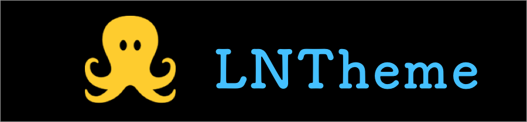

<p align="center">
  
</p>

<p align="center">
<a href="#documents">Documents</a> -
<a href="#introduction">Introduction</a> -
<a href="#demo">Demo</a> -
<a href="#contribution">Contribution</a>
</p>
    
<p align="center">
<a href="http://cocoadocs.org/docsets/LNTheme"></a>
<a href="https://github.com/Carthage/Carthage"></a>
<a href="https://developer.apple.com/ios"></a>
<a href="https://github.com/wedxz/LNTheme/tree/1.0.0"></a>
<a href="https://codebeat.co/projects/github-com-wedxz-lntheme-master"></a>
<a href="https://github.com/wedxz/LNTheme/blob/master/LICENSE"></a>
</p>

# LNTheme
Theme switching OC implementation

## Documents

### Basic Usage
You need to add json configuration file

`NSObject+LNTheme.h`This class contains a collection of methods that support changing properties

```
@property (strong, nonatomic)NSMutableDictionary *themePickers;
- (void)updateTheme;
- (void)ln_customThemeAction:(id(^)(void))block;
@end

@interface UIColor (LNTheme)
+ (UIColor *)colorWithHexString:(NSString *)hexString;
@end
...
```

Picture custom color, please use `UIImage + Tint.h`.

## Installation
####CocoaPods
To integrate LNTheme into your Xcode project using CocoaPods, specify it in your Podfile:

```
pod 'LNTheme'
```
#### Carthage
```
github "wedxz/LNTheme"
```
####Manually
```
Copy all the files in "LNTheme" folder into your project
```
## Demo
Use Netease Cloud Music API

<p align="center">
    
</p>

## Contribution

### Pull Request
Expect your pull request 🙂 But please make sure it's needed by most developers and make it simple to use. If you are not sure you can create a issue and let's discuss before coding.

### Issue
If you find a bug or need a help, you can [create a issue](https://github.com/wedxz/LNTheme/issues/new)

### Contributors
[vvusu](https://github.com/wedxz)

## License

Copyright (c) 2016 vvusu (http://github.com/wedxz)

LNTheme is available under the MIT license. See the LICENSE file for more info.

Permission is hereby granted, free of charge, to any person obtaining a copy
of this software and associated documentation files (the "Software"), to deal
in the Software without restriction, including without limitation the rights
to use, copy, modify, merge, publish, distribute, sublicense, and/or sell
copies of the Software, and to permit persons to whom the Software is
furnished to do so, subject to the following conditions:

The above copyright notice and this permission notice shall be included in all
copies or substantial portions of the Software.

THE SOFTWARE IS PROVIDED "AS IS", WITHOUT WARRANTY OF ANY KIND, EXPRESS OR
IMPLIED, INCLUDING BUT NOT LIMITED TO THE WARRANTIES OF MERCHANTABILITY,
FITNESS FOR A PARTICULAR PURPOSE AND NONINFRINGEMENT. IN NO EVENT SHALL THE
AUTHORS OR COPYRIGHT HOLDERS BE LIABLE FOR ANY CLAIM, DAMAGES OR OTHER
LIABILITY, WHETHER IN AN ACTION OF CONTRACT, TORT OR OTHERWISE, ARISING FROM,
OUT OF OR IN CONNECTION WITH THE SOFTWARE OR THE USE OR OTHER DEALINGS IN THE
SOFTWARE.

